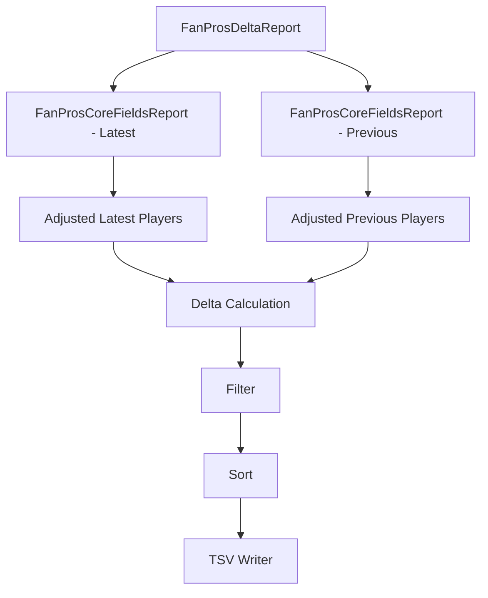
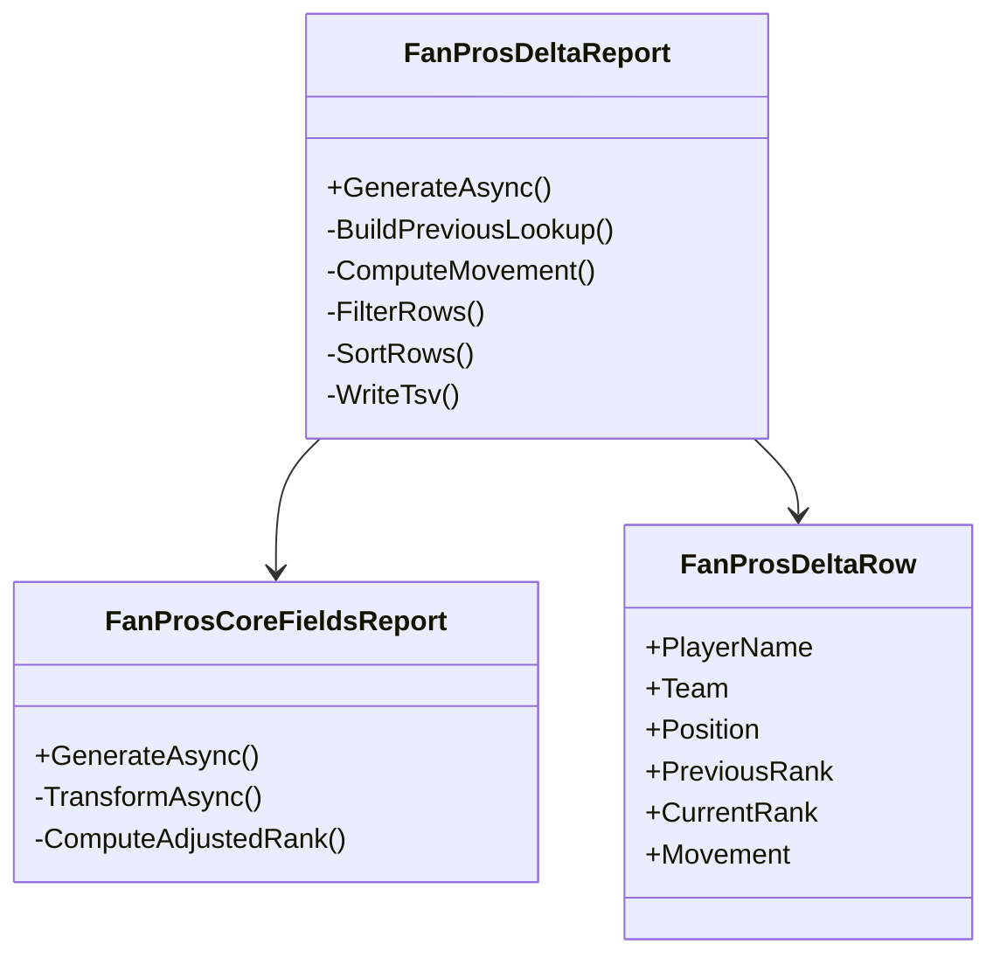
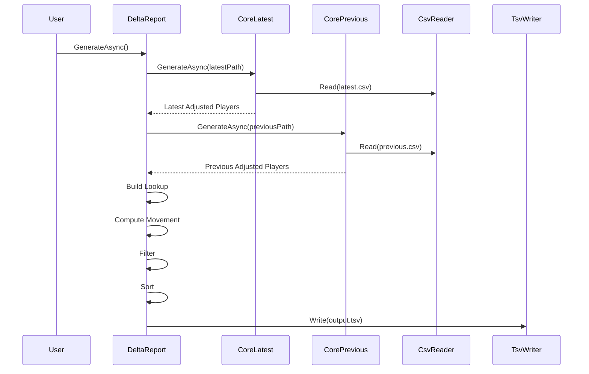
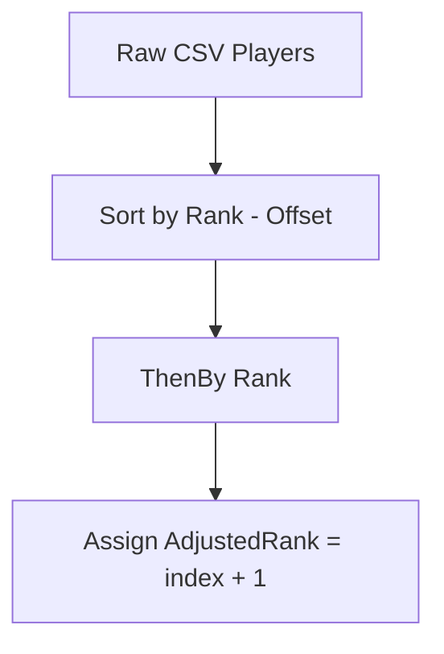
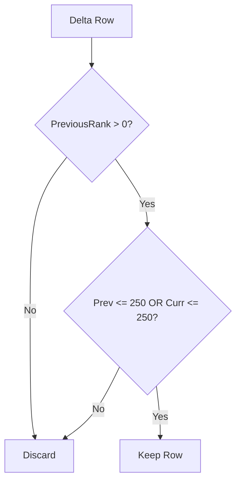
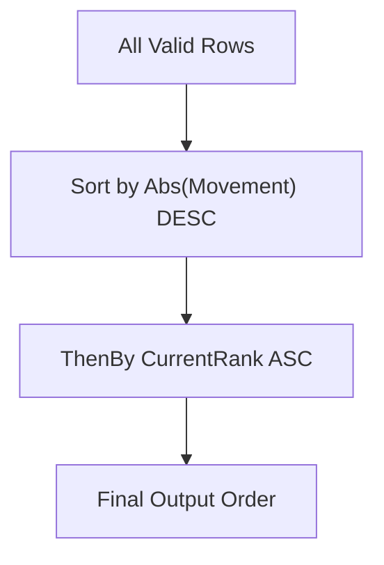
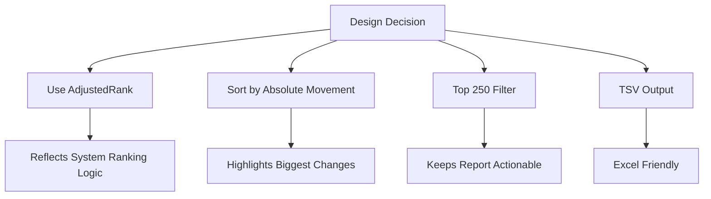
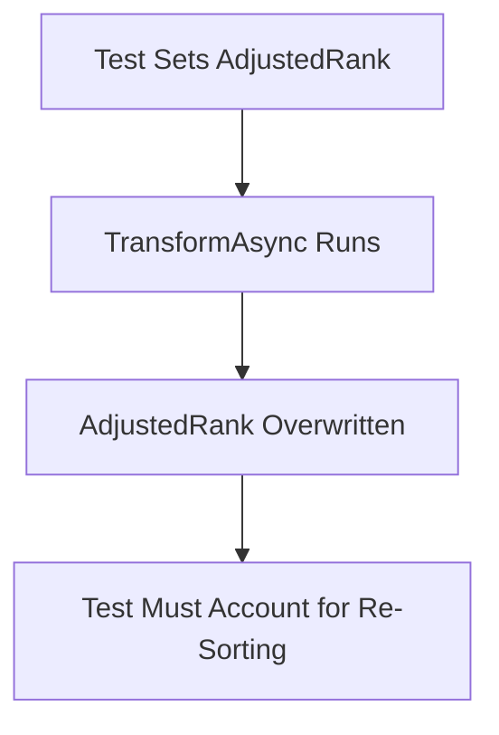
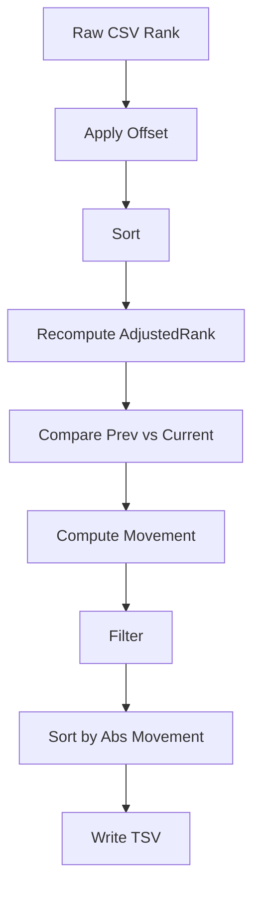

# FanPros Delta Report

Computes player movement between two FanPros ranking snapshots and outputs a TSV report sorted by largest absolute movement.

---

# 1. High-Level Architecture



---

# 2. Responsibility Breakdown



---

# 3. Core Processing Flow



---

# 4. AdjustedRank Computation

Raw rank is NOT used directly for movement.

AdjustedRank is recomputed inside `FanProsCoreFieldsReport`.



Implementation concept:

```
Sort by (Rank - Offset)
Then by Rank
Reassign AdjustedRank sequentially
```

⚠ Any AdjustedRank value supplied in test data will be overwritten.

---

# 5. Movement Formula

Movement is calculated using AdjustedRank:

```
Movement = PreviousAdjustedRank - CurrentAdjustedRank
```

Interpretation:

| Movement | Meaning         |
| -------- | --------------- |
| Positive | Player improved |
| Negative | Player dropped  |
| 0        | No movement     |

---

# 6. Filtering Logic

Only include rows where:

```
PreviousRank > 0
AND
(PreviousRank <= 250 OR CurrentRank <= 250)
```



Purpose:

* Excludes unranked players
* Focuses on Top 250 relevance
* Allows breakout entries

---

# 7. Sorting Strategy

Rows are ordered by:

```
OrderByDescending(Abs(Movement))
ThenBy(CurrentRank)
```



This ensures:

1. Largest movement first
2. Tie → better current rank first

---

# 8. Example Walkthrough

### Current (after AdjustedRank)

| Player | Adjusted |
| ------ | -------- |
| A      | 1        |
| C      | 2        |
| B      | 3        |

### Previous (after AdjustedRank)

| Player | Adjusted |
| ------ | -------- |
| A      | 1        |
| B      | 2        |
| C      | 3        |

### Movement

| Player | Prev | Curr | Move | Abs |
| ------ | ---- | ---- | ---- | --- |
| C      | 3    | 2    | 1    | 1   |
| B      | 2    | 3    | -1   | 1   |
| A      | 1    | 1    | 0    | 0   |

Sorted result:

```
C
B
A
```

---

# 9. Output Format

TSV Columns:

```
PlayerName
Team
Position
PreviousRank
CurrentRank
Movement
```

Output is written via injected `ITsvWriter`.

---

# 10. Key Design Decisions



---

# 11. Testing Considerations

Critical test insight:



When writing tests:

* Never rely on preset AdjustedRank
* Movement must be computed after transformation
* Sorting ties must consider CurrentRank

---

# 12. Full Conceptual Pipeline



---

# Summary Mental Model

The Delta Report measures:

> Movement in the system-adjusted ranking order — not raw FanPros CSV rank.

This ensures movement reflects the same ranking logic used by the application.

---

