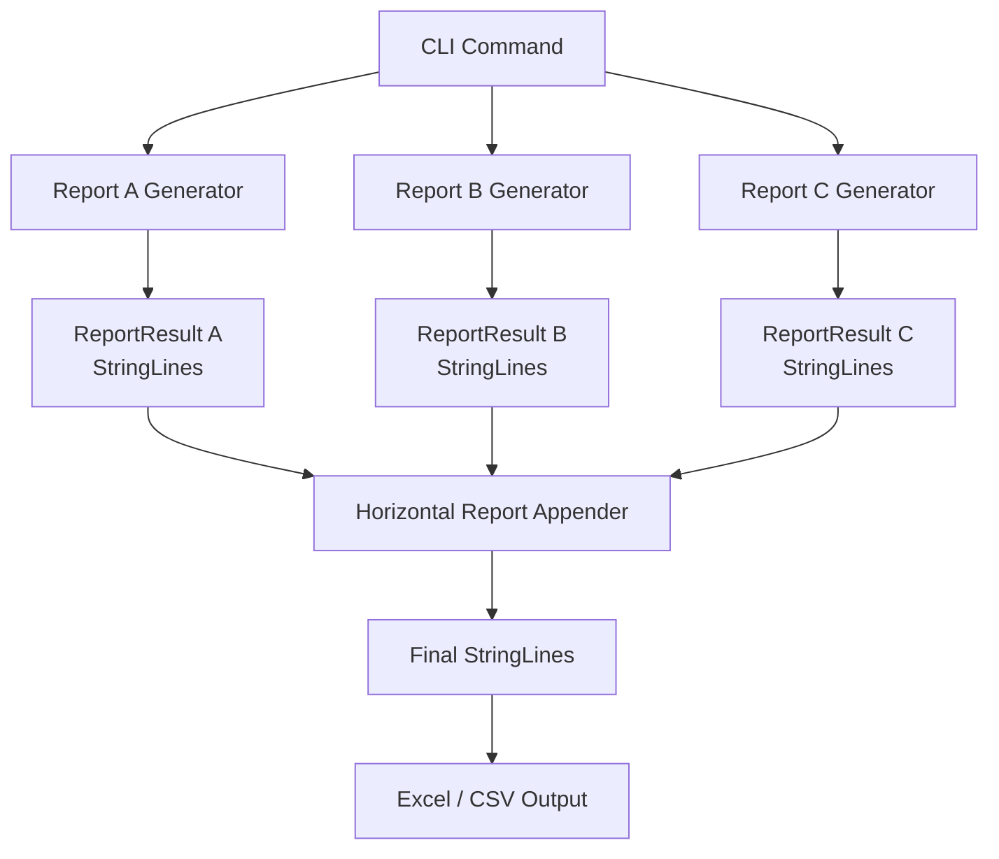
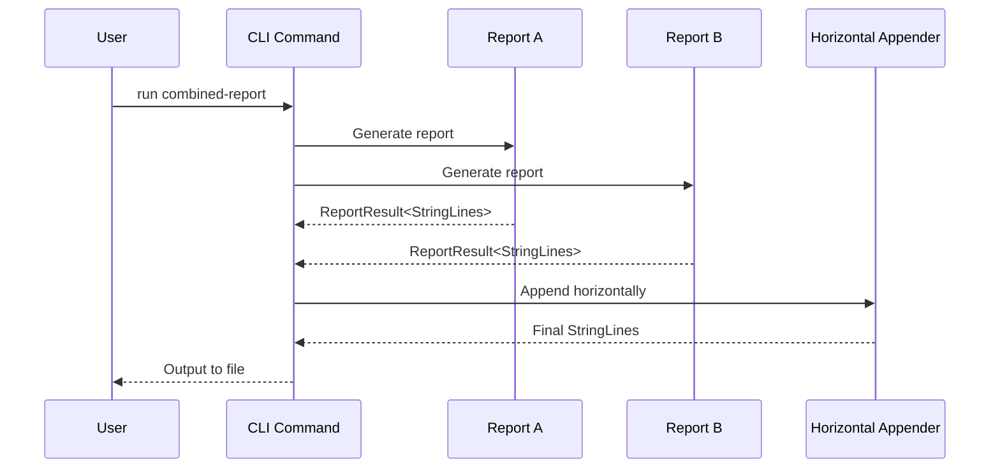
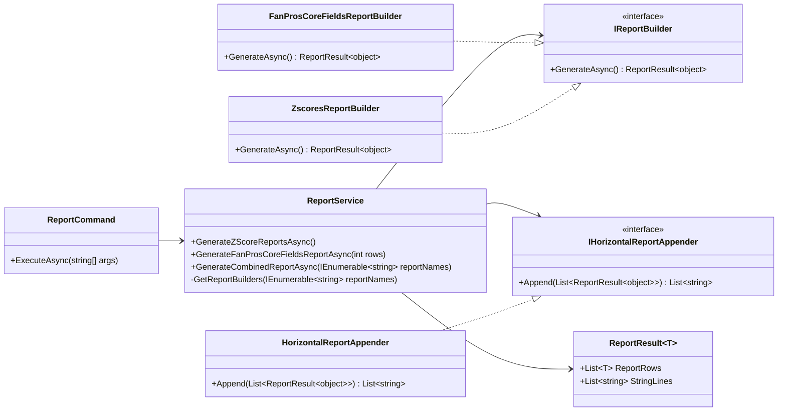
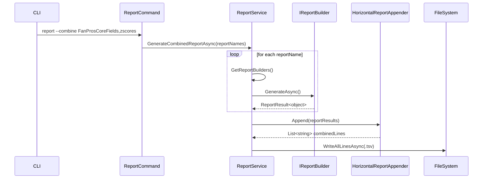
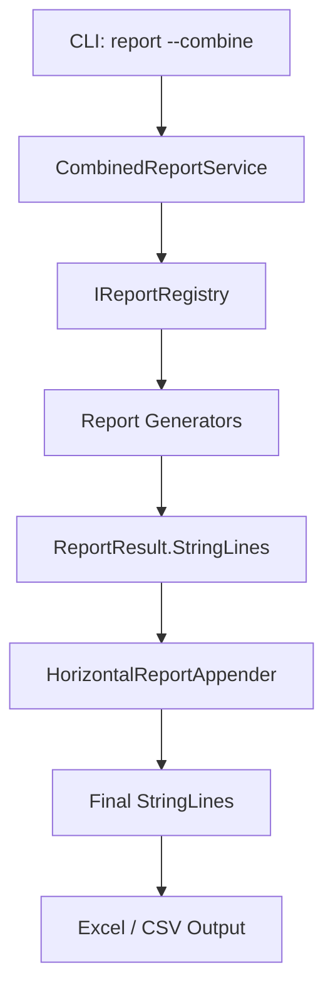
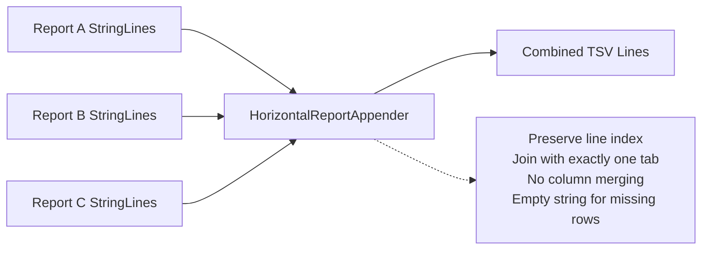
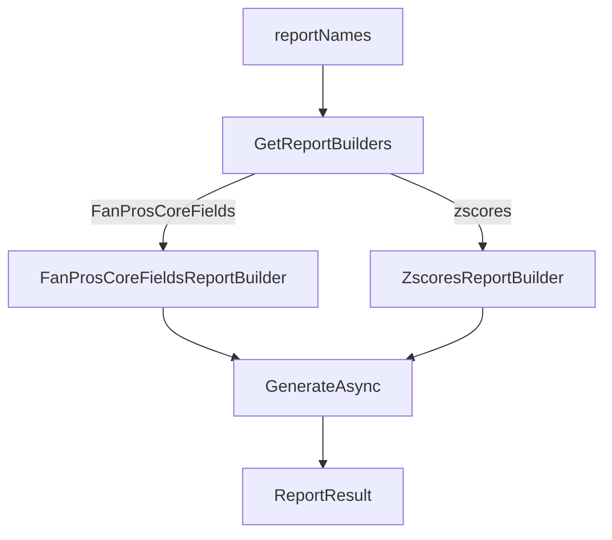

# Joining Reports
### Acceptance Criteria

*Given* multiple reports that output `StringLines`  
*When* I generate a combined report  
*Then* reports are appended horizontally  
*And* each report retains its own columns  
*And* exactly one tab separates reports  
*And* no columns are merged or normalized  
*And* the output opens correctly in Excel

## Architecture Diagram

## Join Flow

## Class Diagram

## CLI Flow Diagram — `report --combine`

## CLI Flow (High-Level Control)

## Horizontal Combination Logic Diagram (Data-Oriented)

Explains why Excel opens this correctly.

## Builder Selection Diagram (Factory via switch)
