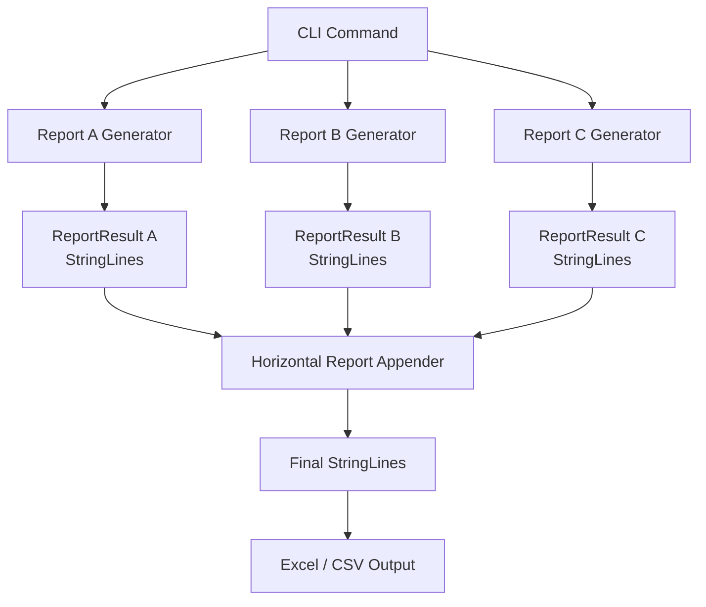
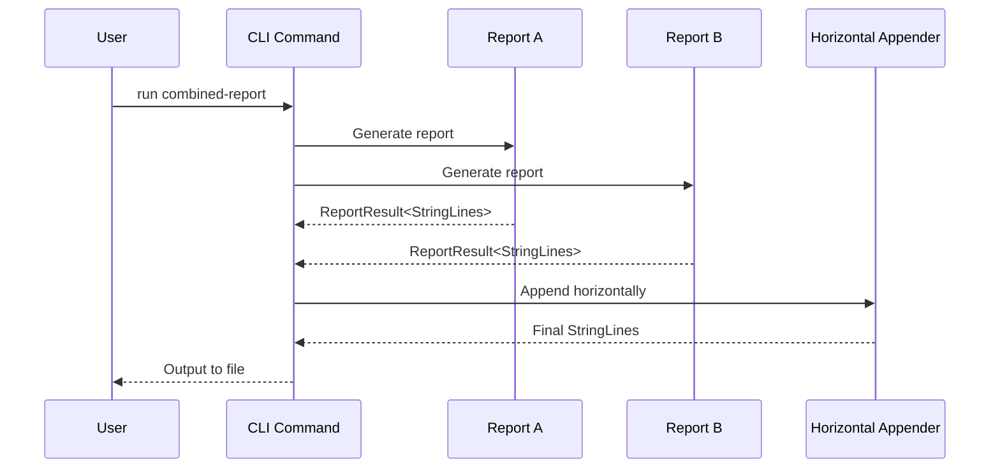

# Joining Reports
## Architecture Diagram

```mermaid
graph TD
    A[CLI Command] --> B[Report A Generator]
    A --> C[Report B Generator]
    A --> D[Report C Generator]

    B --> E[ReportResult A<br/>StringLines]
    C --> F[ReportResult B<br/>StringLines]
    D --> G[ReportResult C<br/>StringLines]

    E --> H[Horizontal Report Appender]
    F --> H
    G --> H

    H --> I[Final StringLines]
    I --> J[Excel / CSV Output]
```
## Join Flow

```mermaid
sequenceDiagram
    participant U as User
    participant CLI as CLI Command
    participant R1 as Report A
    participant R2 as Report B
    participant H as Horizontal Appender

    U->>CLI: run combined-report
    CLI->>R1: Generate report
    CLI->>R2: Generate report
    R1-->>CLI: ReportResult<StringLines>
    R2-->>CLI: ReportResult<StringLines>
    CLI->>H: Append horizontally
    H-->>CLI: Final StringLines
    CLI-->>U: Output to file
```