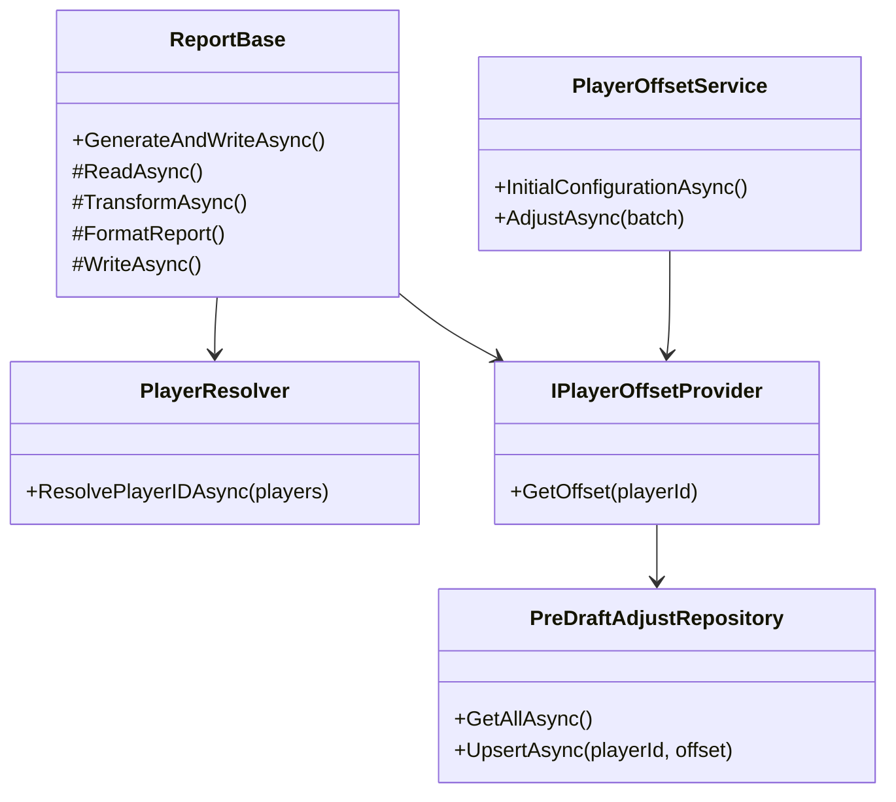
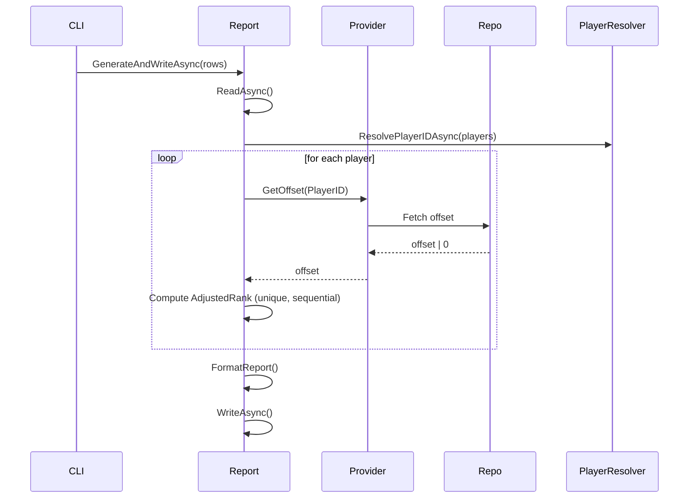
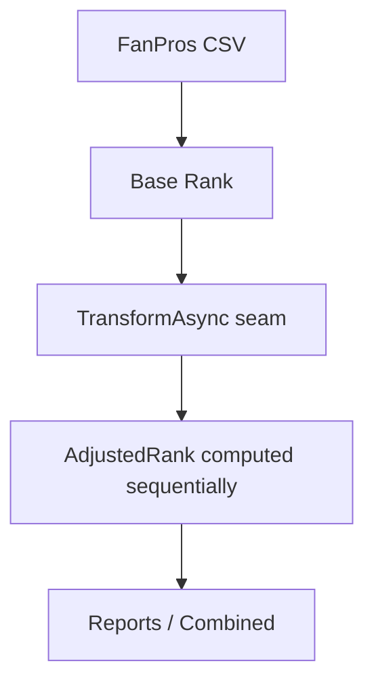
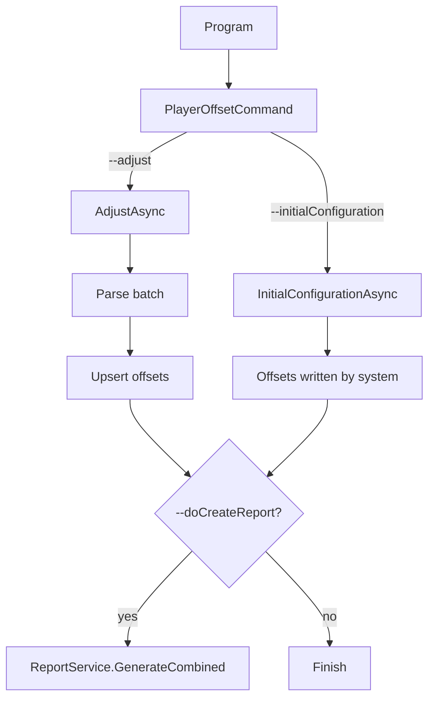
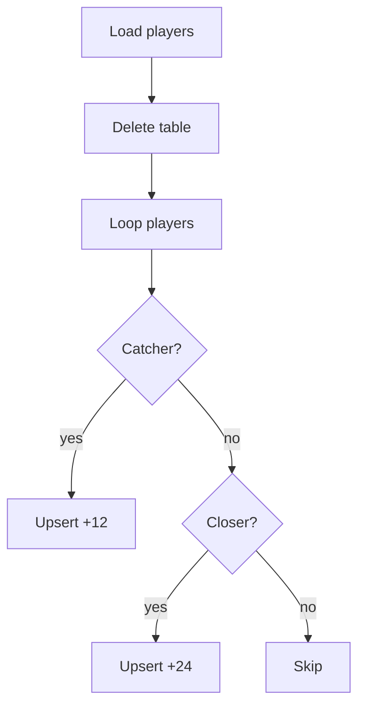
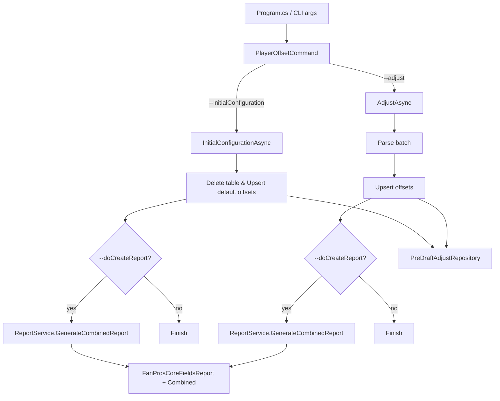

# Pre Draft Ranking
Overview

This feature provides a **pre-draft ranking adjustment layer** on top of base FanPros rankings.
It allows:
- Default system offsets for catchers and closers.
- User-defined offsets via batch commands.
- Deterministic and unique AdjustedRank for reports.

Integration into combined report generation.
## Class / Dependency Diagram

## Report Generation Sequence

**Note**: AdjustedRank is computed **after sorting** and guarantees **unique sequential values**, even when multiple players share the same `Rank - Offset` value.
## Responsibility Flow

## playerOffset CLI Commands
### playerOffset --initialConfiguration [--doCreateReport]
Initializes pre-draft offsets for the top 300 players.
### playerOffset --adjust playerID,12|playerID2,-12 [--doCreateReport]
Updates offsets for individual players in batch.

### Default offset rules (`--initialConfiguration`)

Neutral players (non-catchers, non-closers) are **not stored**, saving database space.
## Compact top-to-bottom flow summary
