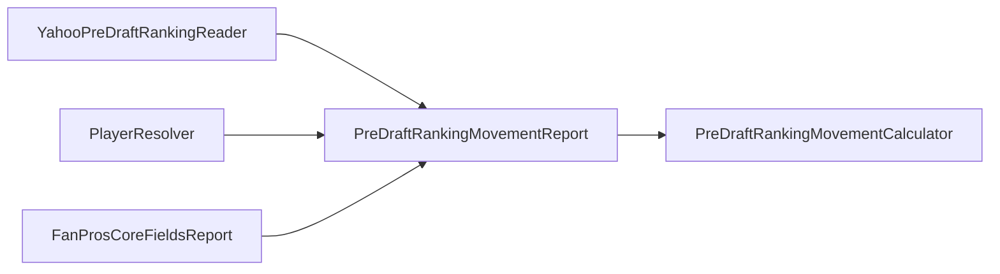
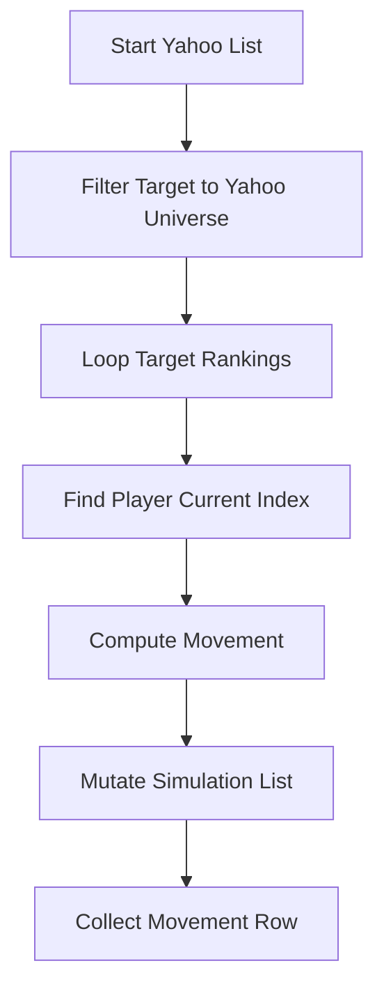
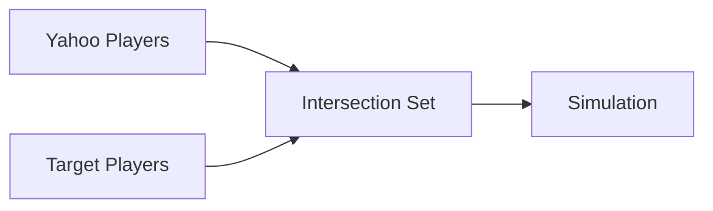
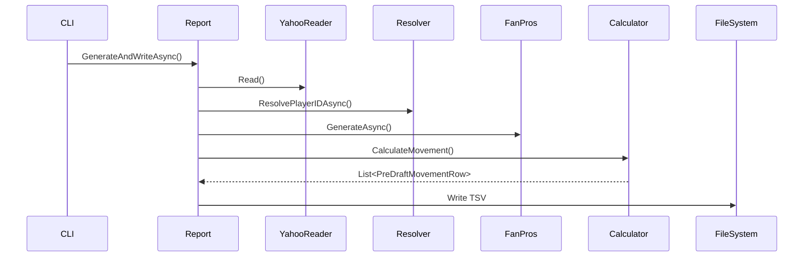

---

# 📄 PreDraft Ranking Movement Feature

## Overview

The **PreDraft Ranking Movement** feature computes the minimal sequence of manual ranking adjustments required to transform the current Yahoo pre-draft ranking into a target ranking derived from FanPros.

It answers the question:

> “What moves do I need to apply in the Yahoo UI to match my target ranking?”

This is **not** a net positional delta report.
It simulates the exact UI movement behavior.

---

# 🧠 Core Concept

There are two ranking states:

* **Start State** → Yahoo pre-draft rankings
* **Target State** → FanPros-generated rankings

The system simulates sequential moves to transform Start → Target.

Important:

* Movements are **sequentially dependent**
* The list mutates after each move
* Only players in the Yahoo universe are considered

---

# 🏗 Architecture



## Responsibility Breakdown

### 1️⃣ `PreDraftRankingMovementReport`

Orchestrator.

Responsibilities:

* Read Yahoo file
* Resolve PlayerIDs
* Retrieve Target rankings
* Call calculator
* Write TSV output
* Console reporting

No domain logic inside.

---

### 2️⃣ `PreDraftRankingMovementCalculator`

Pure domain service.

Responsibilities:

* Filter universe
* Simulate ranking transformation
* Calculate movement deltas
* Track current & target rank
* Return `PreDraftMovementRow`

No IO.
No file system.
No DB access.

Fully unit-testable.

---

# 📦 Domain Model

```csharp
public class PreDraftMovementRow
{
    public int PlayerID { get; set; }
    public string PlayerName { get; set; }
    public int CurrentRank { get; set; }
    public int TargetRank { get; set; }
    public int Movement { get; set; }
}
```

---

# 🔄 Algorithm

## High-Level Process



---

## Sequential Simulation Logic

For each `targetIndex`:

1. Locate player in current simulation list
2. Compute:

```text
movement = currentIndex - targetIndex
```

3. If movement ≠ 0:

   * Remove player from current position
   * Insert at target position
   * Continue with updated list

This mirrors actual Yahoo UI behavior.

---

# 📐 Movement Semantics

Movement represents **manual action required**.

| Scenario                              | Movement |
| ------------------------------------- | -------- |
| Player moves UP                       | Positive |
| Player moves DOWN                     | Negative |
| Player passively shifts due to others | 0        |

Example:

```
Initial:
1 Judge
2 Acuna
3 Witt
4 Julio

Target:
1 Acuna
2 Julio
3 Witt
4 Judge
```

Simulated Moves:

| Player | Movement |
| ------ | -------- |
| Acuna  | +1       |
| Julio  | +2       |
| Witt   | +1       |
| Judge  | 0        |

Judge ends up 4th, but required **no manual move**.

---

# 🧮 Why Not Net Delta?

Net positional difference:

```
Judge: 1 → 4 = -3
```

But this is misleading.

The UI never requires moving Judge.

The feature calculates:

> Minimal manual UI actions

Not:

> Final positional difference

This distinction is critical.

---

# 🌍 Universe Filtering

Target list may contain more players than Yahoo.

To ensure permutation validity:



Only players present in the original Yahoo list are used in the simulation.

This guarantees:

* Same player universe
* Deterministic permutation
* No phantom movement pressure

---

# 🧪 Test Strategy

The calculator is tested independently from IO.

## Covered Scenarios

* Identical lists → zero movement
* Simple swap
* Move up
* Universe filtering
* Missing player safety
* Rank tracking accuracy

Architecture enables:

* Deterministic unit tests
* No file dependency
* No database dependency
* Fast execution

---

# 🔁 Full Sequence Diagram



---

# 🧭 Key Design Decision

The most important design decision:

> Movement measures manual UI action, not net delta.

This ensures the report is operationally actionable.

---

# ✅ Summary

The PreDraft Ranking Movement feature:

* Simulates Yahoo ranking UI behavior
* Produces deterministic manual move instructions
* Is architecturally clean and testable
* Separates orchestration from domain logic
* Is safe against universe mismatches
* Is extensible and maintainable

---
